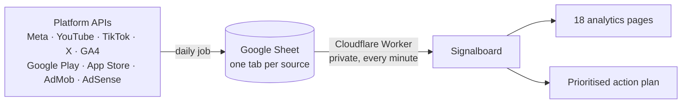

<div align="center">

# Signalboard

**Every platform API in one live dashboard, with an action plan that tells you what to do next.**

[Use this template](../../generate) · [Quick start](#quick-start) · [Supported APIs](#supported-apis) · [Setup guide](docs/SETUP.md) · [Workbook reference](docs/WORKBOOK.md)

  


</div>

Signalboard is a self-hosted analytics dashboard for creators, publishers, app developers and marketing teams who pull data from several platform APIs. Your API data lands in one Google Sheet, one tab per source. Signalboard reads it every minute and turns it into 18 analytics pages and a ranked action plan. It is a static site: no server, no database, no build step.

## Highlights

- **11 platform APIs, one view.** Social, website, ads, app and ad revenue data side by side.
- **An action plan, not just charts.** Tasks ranked by impact, each with the number behind it, what to do, what it is worth and when it counts as done. Resolved tasks drop off automatically.
- **Live.** Data is re-read every minute and the plan recalculates as new rows arrive.
- **White-label in a minute.** Upload a logo and the dashboard takes on its colour. Set your name, currency, theme and pages.
- **Private by design.** Data is read in the browser or through your own Cloudflare Worker, with optional password protection. No tracking.
- **Adapts to your data.** Pages for platforms you don't use hide themselves. New tabs and columns are picked up automatically.

<table>
<tr>
<td width="50%"><p align="center"><b>Action plan</b></p></td>
<td width="50%"><p align="center"><b>Personalize</b></p></td>
</tr>
<tr>
<td width="50%"><p align="center"><b>Four themes</b></p></td>
<td width="50%"><p align="center"><b>Mobile</b></p></td>
</tr>
</table>

## How it works



1. **Collect.** A scheduled job writes each API's daily figures to its own tab: Google Apps Script, a GitHub Actions workflow, your own script, or a no-code tool such as Make or Supermetrics.
2. **Connect.** A small Cloudflare Worker reads the private sheet with a Google service account and serves it only to your dashboard.
3. **Act.** Signalboard measures each metric against its normal range of movement, ranks what needs attention and updates the plan as the numbers change.

## Supported APIs

| Platform | API | Pages |
|---|---|---|
| Facebook | Meta Graph API: Page and post insights | Facebook, Social overview |
| Instagram | Instagram Graph API: account and media insights | Instagram |
| Meta Ads | Meta Marketing API | Paid ads |
| YouTube | YouTube Data API v3, Analytics API, Reporting API | YouTube |
| TikTok | TikTok Display API or Business API | TikTok |
| X | X API v2 | X |
| Website | Google Analytics 4 Data API | Website, Funnels |
| Google Play | Play Console reports, Play Developer Reporting API | App installs, Revenue, App stability |
| App Store | App Store Connect API: Sales and Trends, Analytics Reports | App installs, Revenue |
| AdMob | AdMob API | Ad revenue |
| AdSense | AdSense Management API | Ad revenue |

Every tab, column and endpoint is documented in the [workbook reference](docs/WORKBOOK.md). Use only the platforms you have.

## Quick start

1. Click **Use this template › Create a new repository**.
2. In the new repository, open **Settings › Pages**, set **Source** to *Deploy from a branch*, choose **main** and **/ (root)**, and save.
3. Open `https://<username>.github.io/<repository>/` and click **Try the sample data**.
4. Click **Personalize** to add your logo, name and currency. Click **Download for GitHub** and commit the `config.js` and `img/logo.png` it gives you.

To run it locally, run `python3 -m http.server` in the project folder and open http://localhost:8000.

## Connect your data

| Option | Best for | How |
|---|---|---|
| **Google Sheet via Cloudflare Worker** (recommended) | Private, live data from automated API pulls | Deploy `worker/worker.js`, share the sheet with a service account, set `data.workerUrl` |
| **Link to an .xlsx file** | Pipelines that publish a file | Set `data.fileUrl` |
| **Open a file** | Trying it out, or working in Excel | Drag an .xlsx onto the page. Nothing is uploaded. |

Step-by-step instructions are in the [setup guide](docs/SETUP.md#connect-your-data).

> [!WARNING]
> GitHub Pages sites are public. Never commit a real workbook to the repository; use the Worker for private data.

## Best practices for API data

- **Pull daily and re-pull the last three days.** Platforms revise recent figures. Append rows with a `loaded_at` timestamp and the newest copy wins.
- **Flag failed calls.** Rows with `api_status = error` are ignored, so an outage never shows as a drop to zero.
- **Log every run** to the *Dashboard Status* tab to monitor API health on the Data coverage page.
- **Keep the template's tab and column names.** Platform-native names, such as `impressions`, are recognised too.

## Personalize

Upload a logo in the **Personalize** panel, or commit it as `img/logo.png`. The accent colour is taken from it automatically and adjusted for each theme. Everything else lives in [`config.js`](config.js):

```js
window.DASH = {
  name: 'Your Brand',
  currency: 'EUR',
  theme: 'daylight',
  pages: { hide: ['tiktok'], hideEmpty: true },
  data: { workerUrl: 'https://your-worker.workers.dev', password: true }
};
```

All settings are listed in the [setup guide](docs/SETUP.md#settings-configjs).

## Documentation

- [Setup guide](docs/SETUP.md): connecting data, the Worker, settings and troubleshooting
- [Workbook reference](docs/WORKBOOK.md): every tab, column and API endpoint
- [`dashboard-template.xlsx`](dashboard-template.xlsx): the blank workbook
- [`sample-data.xlsx`](sample-data.xlsx): a filled example

## Contributing

Issues and pull requests are welcome. Action plan rules live in `actions.js` (one `rule(...)` per check), data parsing in `reader.js` and pages in `app.js`.

## Licence

[MIT](LICENSE). Includes [SheetJS Community Edition](https://github.com/SheetJS/sheetjs) under the Apache License 2.0.
