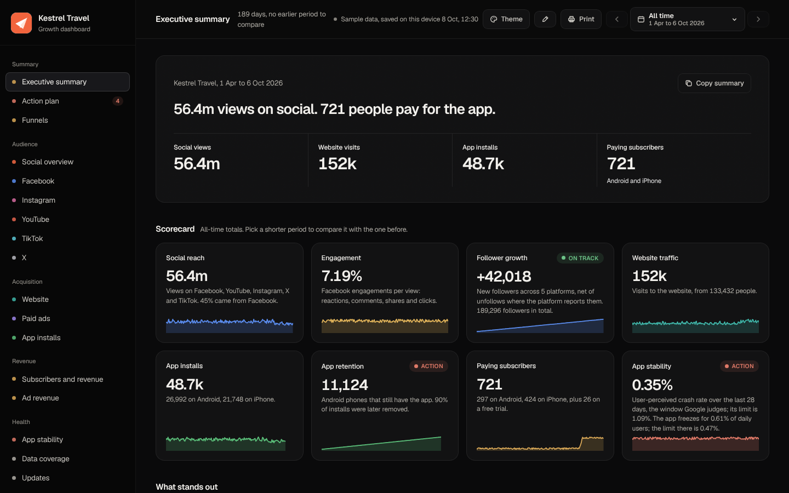
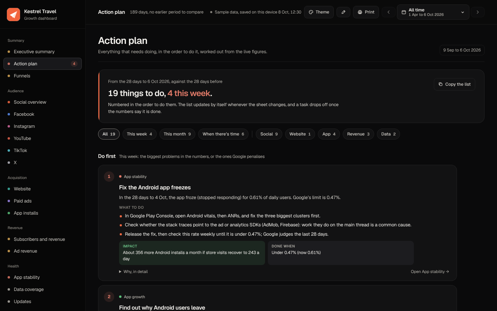
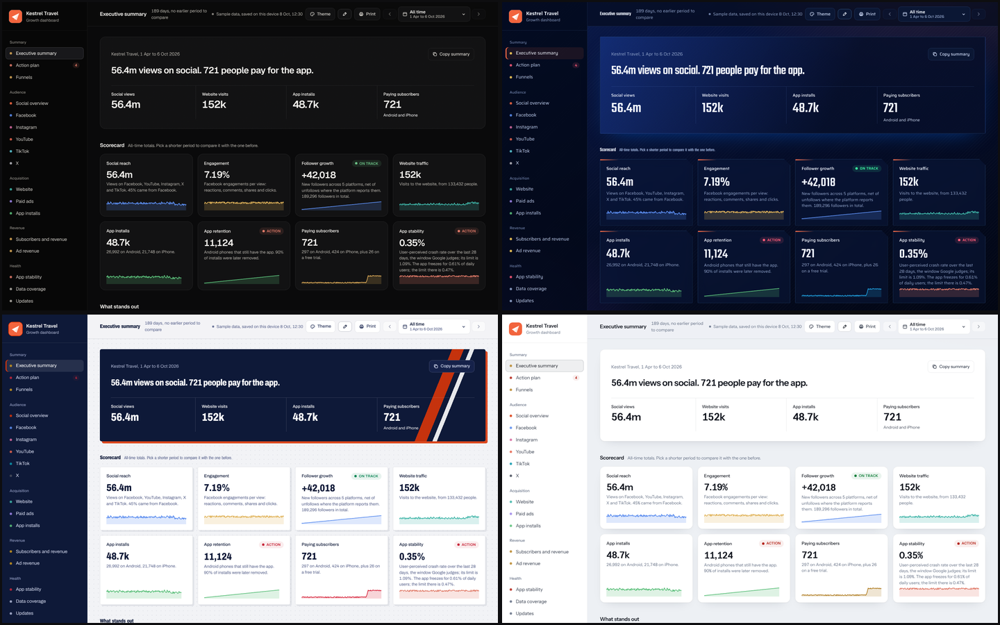
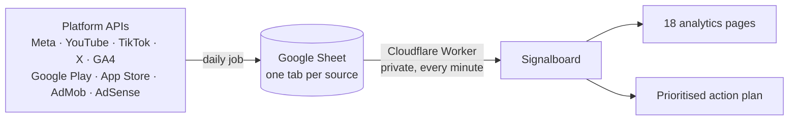

# Signalboard

A live analytics dashboard and action plan for data from 11 platform APIs: Facebook, Instagram, Meta Ads, YouTube, TikTok, X, Google Analytics 4, Google Play, App Store Connect, AdMob and AdSense.

**[Live demo](https://harris6s.github.io/SignalBoard/)** · **[Use this template](https://github.com/harris6s/SignalBoard/generate)**



Signalboard reads your API data from one Google Sheet or Excel workbook, with one tab per source, and turns it into 18 analytics pages and a prioritised action plan. It is a static site with no server, no database and no build step, so it can be hosted free on GitHub Pages.

## Features

- **One view of every platform**: social, website, paid ads, app and ad revenue metrics side by side.
- **Prioritised action plan**: each task shows the metric behind it, the recommended fix, the expected gain and when it counts as done. Tasks close automatically once the data shows they are resolved.
- **Noise filtering**: changes within a metric's normal range are ignored, and the latest week is checked before a task is raised.
- **Live updates**: data is re-read every minute from a private Google Sheet, a hosted .xlsx file or a local file.
- **Private by design**: data is read in the browser or through your own Cloudflare Worker, with optional password protection. No tracking.
- **Configurable**: name, logo, colours, currency, theme and visible pages are set in [`config.js`](config.js).

<p>
  
  
</p>

## How it works



1. **Collect**: a scheduled job writes each API's daily figures to its tab. Google Apps Script, GitHub Actions, your own script or a tool such as Make or Supermetrics all work.
2. **Connect**: a Cloudflare Worker reads the private sheet with a Google service account and serves it only to your dashboard.
3. **Analyse**: Signalboard builds the pages and recalculates the action plan whenever the data changes.

## Supported APIs

| Platform | API | Pages |
|---|---|---|
| Facebook | Meta Graph API: Page and post insights | Facebook, Social overview |
| Instagram | Instagram Graph API: account and media insights | Instagram |
| Meta Ads | Meta Marketing API | Paid ads |
| YouTube | YouTube Data API v3, Analytics API, Reporting API | YouTube |
| TikTok | TikTok Display API or Business API | TikTok |
| X | X API v2 | X |
| Website | Google Analytics 4 Data API | Website, Funnels |
| Google Play | Play Console reports, Play Developer Reporting API | App installs, Revenue, App stability |
| App Store | App Store Connect API: Sales and Trends, Analytics Reports | App installs, Revenue |
| AdMob | AdMob API | Ad revenue |
| AdSense | AdSense Management API | Ad revenue |

Every tab, column and endpoint is listed in the [workbook reference](WORKBOOK.md). Connect only the platforms you use; pages without data are hidden.

## Getting started

1. Fork this repository, or use it as a template.
2. Go to **Settings › Pages**, set **Source** to *Deploy from a branch*, select **main** and **/ (root)**, and save.
3. Open `https://<username>.github.io/signalboard/` and select **Try the sample data**.
4. [Connect your own data](#connecting-your-data).

To run it locally, run `python3 -m http.server` in the project folder and open `http://localhost:8000`.

## Connecting your data

| Option | Best for | Setup |
|---|---|---|
| Google Sheet through a Cloudflare Worker (recommended) | Private, live data from automated API pulls | Deploy [`cloudflare-worker.js`](cloudflare-worker.js), share the sheet with a service account, set `data.workerUrl` |
| Link to an .xlsx file | Pipelines that publish a file | Set `data.fileUrl` |
| Local file | Evaluation, or working directly in Excel | Drop an .xlsx onto the page; it is read in the browser and never uploaded |

Start from the blank [`dashboard-template.xlsx`](dashboard-template.xlsx), or explore [`sample-data.xlsx`](sample-data.xlsx). Full instructions are in the [setup guide](SETUP.md#connect-your-data).

> [!IMPORTANT]
> GitHub Pages sites are public. Keep real data out of the repository and use the Worker for anything private.

## Best practices for API data

- **Pull daily and re-pull the last three days.** Platforms revise recent figures. Append rows with a `loaded_at` timestamp; the newest copy of a row wins.
- **Flag failed calls.** Rows with `api_status` set to `error` are ignored, so an outage never appears as a drop to zero.
- **Log every run** to the *Dashboard Status* tab to monitor API health on the Data coverage page.
- **Keep the template's tab and column names.** Common platform-native names, such as `impressions`, are also recognised.

## Configuration

All settings are in [`config.js`](config.js):

```js
window.DASH = {
  name: 'Your Brand',
  currency: 'EUR',
  theme: 'daylight',
  pages: { hide: ['tiktok'], hideEmpty: true },
  data: { workerUrl: 'https://your-worker.your-account.workers.dev', password: true }
};
```

The full list is in the [setup guide](SETUP.md#settings-configjs).

## Documentation

- [Setup guide](SETUP.md): data connections, the Worker, settings and troubleshooting
- [Workbook reference](WORKBOOK.md): every tab, column and API endpoint

## Contributing

Issues and pull requests are welcome. Action plan rules are in `actions.js`, data parsing in `reader.js` and page rendering in `app.js`.

## License

[MIT](LICENSE). Includes SheetJS Community Edition under the Apache License 2.0 ([license](LICENSE-SheetJS.txt)).
